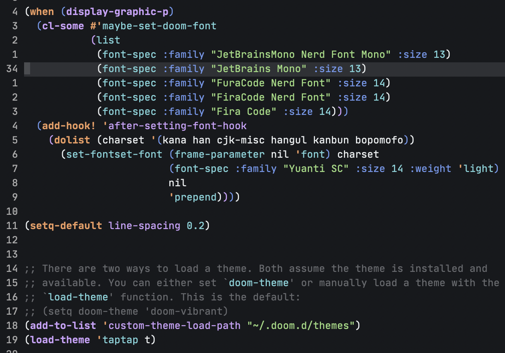

# Introduction

This is the Emacs version of [TapTap theme](https://marketplace.visualstudio.com/items?itemName=TDS.taptap-vscode-theme).

# Installation instructions

Copy (or link) `taptap-theme.el` into `~/.emacs.d/`.

Then add the following line in `init.el`:

    (load-theme 'taptap t)%
